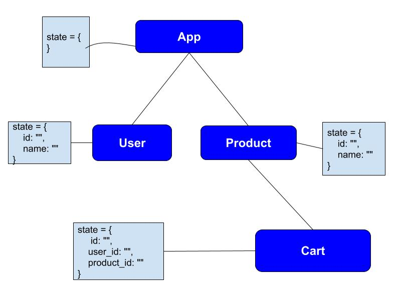
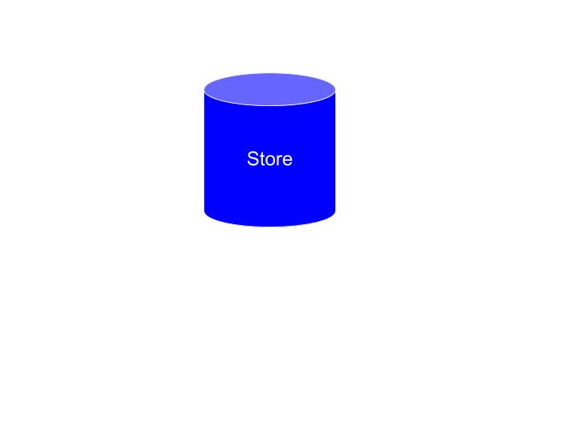
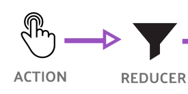
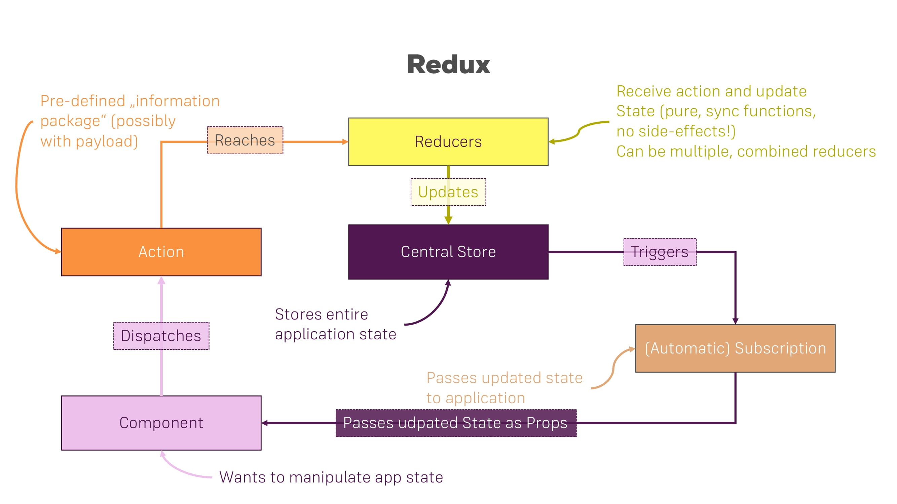

# React Redux

## State Management can be complex

## Redux

Redux is used mostly for application state management. To summarize it, Redux maintains the state of an entire application in a single immutable state tree (object), which can't be changed directly. When something changes, a new object is created (using actions and reducers).

### Redux 
- Store
- Action
- Reducer
- Subscription

#### Store

Store holds your data, You can read or update the data in your store.

### Action

Actions are payloads of information that send data from your application to your store

### Reducer

Reducer is reduce a collection of actions to perform these actions on the data in the store

### Subscription

Subscriptions are called  when the data in the store changes.

### How redux work
